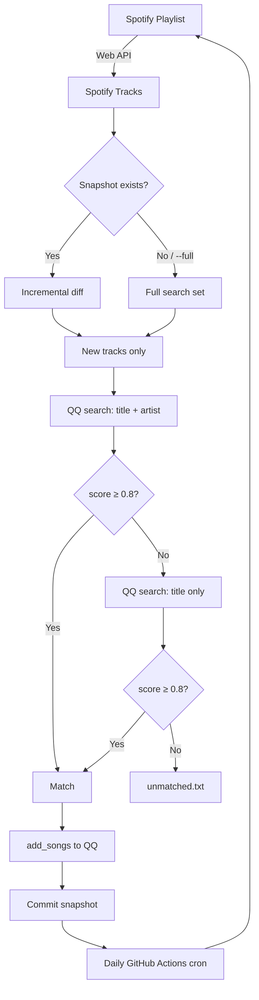

# Spotify → QQ 音乐 每日同步 · Daily Sync

把 Spotify 歌单单向镜像到 QQ 音乐同名歌单：每天增量跑；跨语种歌手（Jay Chou ↔ 周杰伦）靠 QQ 自家的 title-only 兜底搜。
One-way mirror from a Spotify playlist to the same-named QQ Music playlist — runs daily; cross-language artists are bridged by a title-only fallback against QQ's own catalog.

## 流程 · Flow



## 快速开始 · Setup

```bash
make install                # 装依赖 / install deps
cp .env.example .env        # 复制配置

make bootstrap-spotify      # 一次性 Spotify OAuth，打印 refresh token
make bootstrap-qq           # 一次性 QQ 扫码登录（手机 QQ 扫），打印 QQ_CREDENTIAL_JSON
# 把上面两个产物写回 .env

spotify-sync playlists -s "源歌单" -q "目标歌单"
# 或交互式: spotify-sync playlists
```

- Spotify 开发者应用: https://developer.spotify.com/dashboard — Redirect URI 必须 **精确** 填 `http://127.0.0.1:8765/callback`
- 目标歌单不存在会自动新建 QQ 侧 / QQ target playlist is auto-created if missing

## 日常 · Daily usage

```bash
spotify-sync                    # 默认 = sync (增量)
spotify-sync sync --dry-run     # 预览，不写 QQ
spotify-sync sync --full        # 全量重搜，绕过 snapshot
spotify-sync sync --full --dry-run

make test                       # 跑测试 / 94 cases
```

跑完看 `data/sync.log` 和 `data/unmatched.txt`。

## 增量 vs `--full` · Incremental vs Full

| 模式 Mode | 何时用 When |
|---|---|
| 增量 (默认) / Incremental | 每日自动跑。只搜 Spotify 新加的歌，删除 Spotify 移除的歌。命中缓存零 API 调用。 |
| `--full` | 缓存漂移、手动改了 QQ 侧、或 Matcher 调参后想重新评估全量。 |

增量靠 `playlist_snapshot` 表记录上次成功同步后的 Spotify track id 集合；下次对比得出 `added / kept / removed`。只有 `added` 走 QQ 搜索；`kept` 直接复用 `track_map_cache` 里的 QQ 映射；`removed` 用缓存映射反查 QQ id 直接删。

## Title-only 兜底 · Fallback

主搜 `title + artist`；若打不到 0.8 分，再搜一次 `title` 本身。QQ 自家库就有中文艺人版本，靠 duration / ISRC 挑对。

- 零外部 API 依赖
- 每次 miss 多一次 QQ 搜索 (~0.5 秒)
- 覆盖率 ≈ MusicBrainz 别名，速度快 3 倍

Primary search is `title + artist`. On miss (<0.8), retry with just `title`; QQ's own index already holds Chinese-artist versions, so ISRC + duration carry the match. No external alias API — ~3x faster than the prior MusicBrainz path.

## Matcher 评分 · Scoring

| 特征 Feature | 权重 Weight |
|---|---|
| ISRC 完全相等 (强信号) | `1.0` |
| 标题归一化后相等 | `0.4` |
| 主艺人命中 (集合交集) | `0.2` |
| 时长 ±3s | `0.4` |

阈值 `0.8`。`title + duration`（跨语种艺人常见）刚好过线；仅 `duration` (0.4) 会被过滤。

## .env 字段

| 字段 | 说明 |
|---|---|
| `SPOTIFY_CLIENT_ID` / `SPOTIFY_CLIENT_SECRET` | Spotify 开发者后台 |
| `SPOTIFY_REFRESH_TOKEN` | `bootstrap-spotify` 生成 |
| `SPOTIFY_PLAYLIST_NAME` / `QQ_PLAYLIST_NAME` | 源/目标歌单名 |
| `QQ_CREDENTIAL_JSON` | `bootstrap-qq` 生成（单行 JSON） |
| `MIRROR_DELETE_THRESHOLD` | 镜像安全阀（默认 `0.2`，超出直接 abort） |
| `GH_PAT_SECRETS_WRITE` | 可选，fine-grained PAT，权限 `secrets:write`，给 Actions 自动刷新 `QQ_CREDENTIAL_JSON` 用 |

## GitHub Actions

仓库自带 `.github/workflows/sync.yml`。把 `.env` 里的值配成 Repository Secrets 即可：

- `SPOTIFY_CLIENT_ID` / `SPOTIFY_CLIENT_SECRET` / `SPOTIFY_REFRESH_TOKEN`
- `SPOTIFY_PLAYLIST_NAME` / `QQ_PLAYLIST_NAME`
- `QQ_CREDENTIAL_JSON`
- `GH_PAT_SECRETS_WRITE`（可选）

配好后每天 UTC 19:00（北京 03:00）自动跑；Actions 页面手点 `Run workflow` 可触发 dry-run 或 full 模式。
产物：`data/` 分支自动 commit 回 SQLite + 日志；`sync.log` + `unmatched.txt` 作 30 天 artifact。

## 常见问题 · Troubleshooting

- **QQ 扫码时手机在哪点？** 打开 **手机 QQ**（聊天那个） → 扫一扫。不是 QQ 音乐 App。QQ 音乐账号用 QQ 账号授权。
- **Spotify redirect_uri 报错？** Spotify 控制台里的 Redirect URI 必须精确等于 `http://127.0.0.1:8765/callback`，末尾不要加斜杠。
- **`unmatched.txt` 空的？** 好事 — 说明全匹配上了。
- **有首歌没过？** 打开 `data/unmatched.txt`，跨平台 metadata 常年对不上是常态；人工加一下就好。
- **QQ 登录态过期？** 重跑 `make bootstrap-qq`，把新 `QQ_CREDENTIAL_JSON` 更新到 `.env` 或 Repository Secret。如果配了 `GH_PAT_SECRETS_WRITE`，Actions 里 musickey 刷新会自动写回。
- **想重置增量？** 删 `data/sync.db` 里的 `playlist_snapshot` 表，或直接跑 `--full` 一次。

## 项目结构 · Layout

```
src/
  main.py                # CLI 入口 / CLI entry
  config.py              # 读 .env
  spotify_client.py      # Spotify Web API
  qqmusic_client.py      # qqmusic-api-python 的同步封装
  matcher.py             # 归一化 + 打分
  incremental.py         # Snapshot 增量 plan
  diff_engine.py         # Mirror diff + 安全阀
  sync_service.py        # 主流程 orchestrator（含 title-only 兜底）
  db.py                  # SQLite schema + DAO
  report.py              # 同步报告 + 日志
scripts/                 # bootstrap 脚本
tests/                   # pytest, 94 cases
data/                    # 运行产物: sync.db / sync.log / unmatched.txt
```

## 参考 · References

- Spotify Web API — https://developer.spotify.com/documentation/web-api
- qqmusic-api-python — https://pypi.org/project/qqmusic-api-python/
