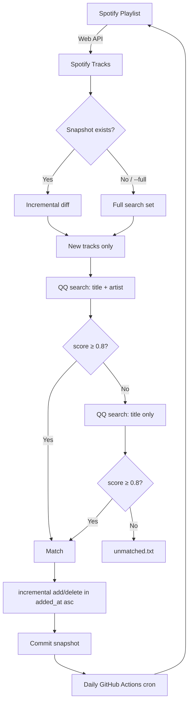

# Spotify → QQ 音乐 每日同步 · Daily Sync

把 Spotify 歌单单向镜像到 QQ 音乐同名歌单：每天增量跑；匹配必须有歌手证据；QQ 侧保持 Spotify 加入时间顺序。
One-way mirror from a Spotify playlist to the same-named QQ Music playlist — runs daily; matches require artist evidence; QQ keeps Spotify added-time order.

## 流程 · Flow


```mermaid
flowchart TD
    A[Spotify Playlist] -->|Web API| B[Spotify Tracks]
    B --> C{Snapshot exists?}
    C -->|Yes| D[Incremental diff]
    C -->|No / --full| E[Full search set]
    D --> F[New tracks only]
    E --> F
    F --> G[QQ search: title + artist]
    G --> H{score ≥ 0.8?}
    H -->|Yes| J[Match]
    H -->|No| I[QQ search: title only]
    I --> K{score ≥ 0.8?}
    K -->|Yes| J
    K -->|No| L[unmatched.txt]
    J --> M[incremental add/delete in added_at asc]
    M --> N[Commit snapshot]
    N --> O[Daily GitHub Actions cron]
    O --> A
```

## 先装 uv · Install uv

```bash
curl -LsSf https://astral.sh/uv/install.sh | sh     # macOS / Linux
# or: brew install uv
```

uv 用 `pyproject.toml` + `uv.lock` 管依赖。两份文件都在 repo 里，版本完全一致。

## 快速开始 · Setup

```bash
git clone https://github.com/jiaweizhang1995/spotify-sync-qqmusic.git
cd spotify-sync-qqmusic

make install                # uv sync — 建 .venv + 按 lockfile 装依赖
cp .env.example .env        # 复制配置

make bootstrap-spotify      # 一次性 Spotify OAuth，打印 refresh token
make bootstrap-qq           # 一次性 QQ 扫码登录（手机 QQ 扫），打印 QQ_CREDENTIAL_JSON
# 把上面两个产物写回 .env

uv run spotify-sync playlists -s "源歌单" -q "目标歌单"
# 或交互式: uv run spotify-sync playlists
```

- Spotify 开发者应用: https://developer.spotify.com/dashboard — Redirect URI 必须 **精确** 填 `http://127.0.0.1:8765/callback`
- 目标歌单不存在会自动新建 QQ 侧 / QQ target playlist is auto-created if missing

### 可选：装 shell wrapper · Optional shell wrapper

把 `spotify-sync` 做成全局命令（不用 `uv run` 前缀）：

```bash
cat > ~/.local/bin/spotify-sync <<'EOF'
#!/usr/bin/env bash
set -e
PROJECT_DIR="<absolute path to this repo>"
if [ $# -eq 0 ]; then
  exec uv run --project "$PROJECT_DIR" spotify-sync sync
else
  exec uv run --project "$PROJECT_DIR" spotify-sync "$@"
fi
EOF
chmod +x ~/.local/bin/spotify-sync
```

之后终端任意目录敲 `spotify-sync` 就跑。

## 日常 · Daily usage

装了 wrapper 后：

```bash
spotify-sync                       # 默认 = sync (增量)
spotify-sync sync --dry-run        # 预览，不写 QQ
spotify-sync sync --full           # 全量重搜，绕过 snapshot
spotify-sync sync --full --dry-run
spotify-sync reorder --dry-run     # 只预览顺序重建
```

没装 wrapper 时全用 `uv run`：

```bash
uv run spotify-sync                 # 同上
uv run spotify-sync sync --dry-run
uv run pytest tests/ -q             # 跑测试 / 117 cases
make test                           # 快捷方式
```

跑完看 `data/sync.log` 和 `data/unmatched.txt`。

## 增量 vs `--full` · Incremental vs Full

| 模式 Mode | 何时用 When |
|---|---|
| 增量 (默认) / Incremental | 每日自动跑。只搜 Spotify 新加且从未处理过的歌，删除 Spotify 移除的歌。命中缓存或历史未匹配都零 API 调用。 |
| `--full` | 缓存漂移、手动改了 QQ 侧、想重试历史未匹配、或 Matcher 调参后想重新评估全量。 |

增量靠 `playlist_snapshot` 表记录上次成功同步后的 Spotify track id 集合；下次对比得出 `added / kept / removed`。只有新且未知的 track 走 QQ 搜索；命中过 `track_map_cache` 的直接复用 QQ 映射；命中过 `unmatched_tracks` 的默认跳过不重试；`removed` 用缓存映射反查 QQ id。

日常同步只做差量删除/新增；新增会按 Spotify `added_at` 升序写入 QQ。QQ 音乐按“添加时间倒序”显示时，最上面就是 Spotify 最新加入的歌。只有检测到 QQ 侧顺序已经漂移、差量写入无法修正时，才会触发安全阀保护下的顺序重建。

## Title-only 兜底 · Fallback

主搜 `title + artist`；若打不到 0.8 分，再搜一次 `title` 本身。候选除非 ISRC 完全一致，否则必须有歌手重叠；跨语种歌手用 MusicBrainz 别名做最后校验。

- 每次 miss 多一次 QQ 搜索 (~0.5 秒)
- 别名查询有 SQLite 缓存，并按 MusicBrainz 1 req/s 限速
- `title + duration` 但歌手不一致会进 `unmatched.txt`，不会自动同步错歌手版本

Primary search is `title + artist`. On miss (<0.8), retry with just `title`; unless ISRC matches exactly, the selected candidate must also match an artist name or alias.

## Matcher 评分 · Scoring

| 特征 Feature | 权重 Weight |
|---|---|
| ISRC 完全相等 (强信号) | `1.0` |
| 标题归一化后相等 | `0.4` |
| 主艺人命中 (集合交集) | `0.2` |
| 时长 ±3s | `0.4` |

阈值 `0.8`，并且除 ISRC 完全一致外还要求歌手命中。`title + duration` 的原始分数仍是 0.8，但如果歌手不匹配会被拒绝。

## .env 字段

| 字段 | 说明 |
|---|---|
| `SPOTIFY_CLIENT_ID` / `SPOTIFY_CLIENT_SECRET` | Spotify 开发者后台 |
| `SPOTIFY_REFRESH_TOKEN` | `bootstrap-spotify` 生成 |
| `SPOTIFY_PLAYLIST_NAME` / `QQ_PLAYLIST_NAME` | 源/目标歌单名 |
| `QQ_CREDENTIAL_JSON` | `bootstrap-qq` 生成（单行 JSON） |
| `MIRROR_DELETE_THRESHOLD` | 镜像安全阀（默认 `0.2`，超出直接 abort） |
| `GH_PAT_SECRETS_WRITE` | 可选，fine-grained PAT，权限 `secrets:write`，给 Actions 自动刷新 `QQ_CREDENTIAL_JSON` 用 |

## GitHub Actions

仓库自带 `.github/workflows/sync.yml`。把 `.env` 里的值配成 Repository Secrets 即可：

- `SPOTIFY_CLIENT_ID` / `SPOTIFY_CLIENT_SECRET` / `SPOTIFY_REFRESH_TOKEN`
- `SPOTIFY_PLAYLIST_NAME` / `QQ_PLAYLIST_NAME`
- `QQ_CREDENTIAL_JSON`
- `GH_PAT_SECRETS_WRITE`（可选）

配好后每天 UTC 11:00（北京 19:00）自动跑；Actions 页面手点 `Run workflow` 可触发 dry-run。
CI 使用 `uv sync --frozen` 严格按 `uv.lock` 装依赖 → 本地和线上版本完全一致。
产物：`data/` 分支自动 commit 回 SQLite + 日志；`sync.log` + `unmatched.txt` 作 30 天 artifact。

## 常见问题 · Troubleshooting

- **QQ 扫码时手机在哪点？** 打开 **手机 QQ**（聊天那个） → 扫一扫。不是 QQ 音乐 App。QQ 音乐账号用 QQ 账号授权。
- **Spotify redirect_uri 报错？** Spotify 控制台里的 Redirect URI 必须精确等于 `http://127.0.0.1:8765/callback`，末尾不要加斜杠。
- **`unmatched.txt` 空的？** 好事 — 说明全匹配上了。
- **有首歌没过？** 打开 `data/unmatched.txt`，跨平台 metadata 常年对不上是常态；默认增量不会反复重试这些歌。想重试就跑 `spotify-sync sync --full`。
- **QQ 登录态过期？** 重跑 `make bootstrap-qq`，把新 `QQ_CREDENTIAL_JSON` 更新到 `.env` 或 Repository Secret。如果配了 `GH_PAT_SECRETS_WRITE`，Actions 里 musickey 刷新会自动写回。
- **想重置增量？** 删 `data/sync.db` 里的 `playlist_snapshot` 表，或直接跑 `--full` 一次。

## 项目结构 · Layout

```
pyproject.toml           # 项目元数据 + 依赖 + entry point
uv.lock                  # 锁定的依赖版本（committed）
Makefile                 # make install/sync/test/... 全部走 uv
src/
  main.py                # CLI 入口 / CLI entry (spotify-sync 命令指向这里)
  config.py              # 读 .env
  spotify_client.py      # Spotify Web API
  qqmusic_client.py      # qqmusic-api-python 的同步封装
  matcher.py             # 归一化 + 打分
  incremental.py         # Snapshot 增量 plan
  diff_engine.py         # Mirror diff + 安全阀
  sync_service.py        # 主流程 orchestrator（含歌手强校验 + 顺序重建）
  reorder_service.py     # 只做 QQ 顺序重建
  db.py                  # SQLite schema + DAO
  report.py              # 同步报告 + 日志
scripts/                 # bootstrap 脚本
tests/                   # pytest, 117 cases
data/                    # 运行产物: sync.db / sync.log / unmatched.txt
```

## 参考 · References

- Spotify Web API — https://developer.spotify.com/documentation/web-api
- qqmusic-api-python — https://pypi.org/project/qqmusic-api-python/
- uv — https://docs.astral.sh/uv/
